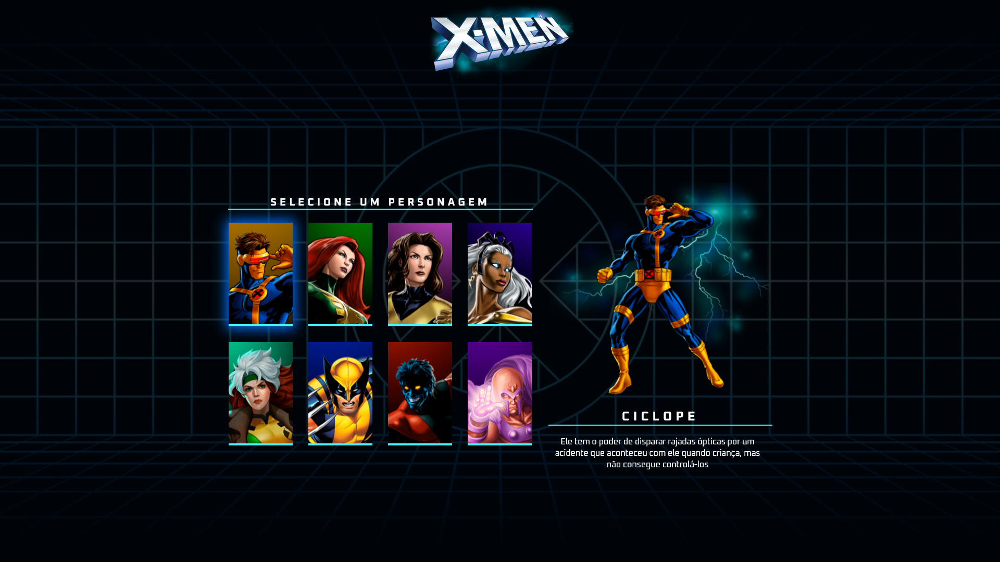
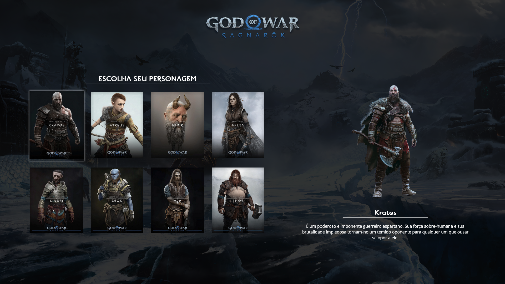
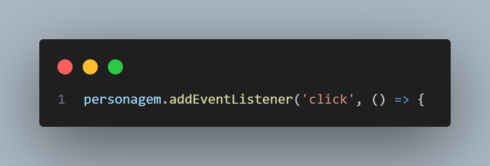
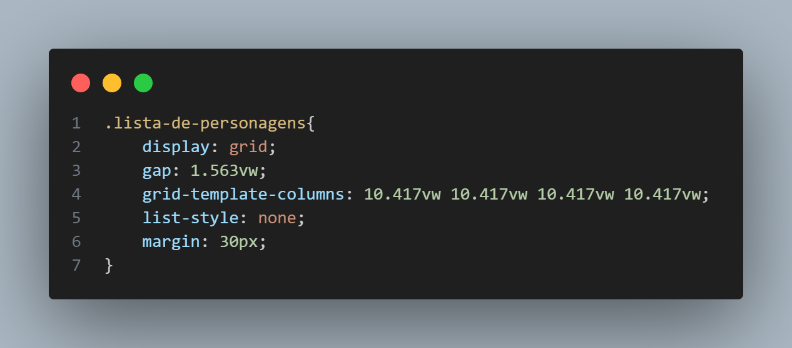

# Escolha de Personagens | God of War Ragnarok

## Resumo

Este repositório representa meu trabalho colaborativo no projeto do canal [Dev em Dobro](https://www.instagram.com/devemdobro/), onde pude exercitar minhas habilidades de desenvolvimento web utilizando HTML, CSS e Javascript. É um projeto que reflete minha paixão pelo jogo God of War Ragnarok e minha criatividade em adaptar o conceito original para algo que me traz ainda mais interesse e envolvimento.

O projeto consiste em uma interface interativa e responsiva, onde os usuários podem explorar e selecionar diferentes personagens do jogo God of War Ragnarok.

## Tecnologias Utilizadas

* __HTML__: Utilizando HTML, foi construída a estrutura básica da página, com elementos e seções bem organizados.

* __CSS__: A estilização foi implementada utilizando CSS, dando vida e personalidade ao projeto. Foram aplicadas cores e estilos que remetem ao universo de God of War Ragnarok, criando uma atmosfera imersiva para os usuários.

* __JavaScript__: A interatividade e dinamismo da página foram alcançados com a programação em Javascript. Por meio do Javascript, foi possível adicionar funcionalidades como seleção de personagens, exibição de informações diferentes a cada personagem selecionado.

## Diferenciais

### Mudança no tema

Ao escolher adaptar o projeto original de escolha de personagens do X-Men para o universo de God of War Ragnarok, consegui trazer um novo tema e experiência para os usuários.

Explorei a rica mitologia nórdica, os personagens icônicos e o visual impressionante do jogo para criar uma experiência imersiva e atraente para os usuários.

 

***

### Evento 'click'

No projeto, adotei a abordagem de utilizar o evento __click__ em vez do evento __mouseenter__, diferentemente do projeto original. Após o clique do usuário em um personagem, as informações relacionadas a ele são exibidas. Essa escolha visa oferecer uma experiência mais intuitiva e acessível aos usuários, permitindo que eles explorem as informações dos personagens no seu próprio ritmo e conforme sua vontade.

***

### Uso do grid

Outro diferencial importante deste projeto é a utilização do __grid__ para criar um layout flexível. Diferentemente do uso de __flex-wrap__ no projeto original, optei por explorar as capacidades do grid para criar um layout mais organizado e responsivo.

Ao empregar os conceitos de grid, consegui obter maior flexibilidade e controle na estrutura do projeto, resultando em um layout adaptável em diferentes dispositivos e tamanhos de tela.

## Veja o funcionamento!

Neste GIF animado, você pode conferir o projeto em pleno funcionamento. Ele mostra as interações e recursos implementados, oferecendo uma visão geral da experiência proporcionada pelo projeto.

## Acesse o Projeto

Você pode acessar e interagir com o projeto através do GitHub Pages. Clique no link abaixo para experimentar:

➜ [https://kaiknunes.github.io/God-of-War/](https://kaiknunes.github.io/God-of-War/)

Certifique-se de conferir e explorar todas as funcionalidades disponíveis no projeto.

Agradeço por dedicar seu tempo para visitar o repositório do projeto. Espero que tenha encontrado as informações e recursos apresentados úteis e interessantes.

Fico feliz em compartilhar meu trabalho e conhecimento com a comunidade de desenvolvedores. Se tiver alguma dúvida, sugestão ou feedback, não hesite em entrar em contato.
